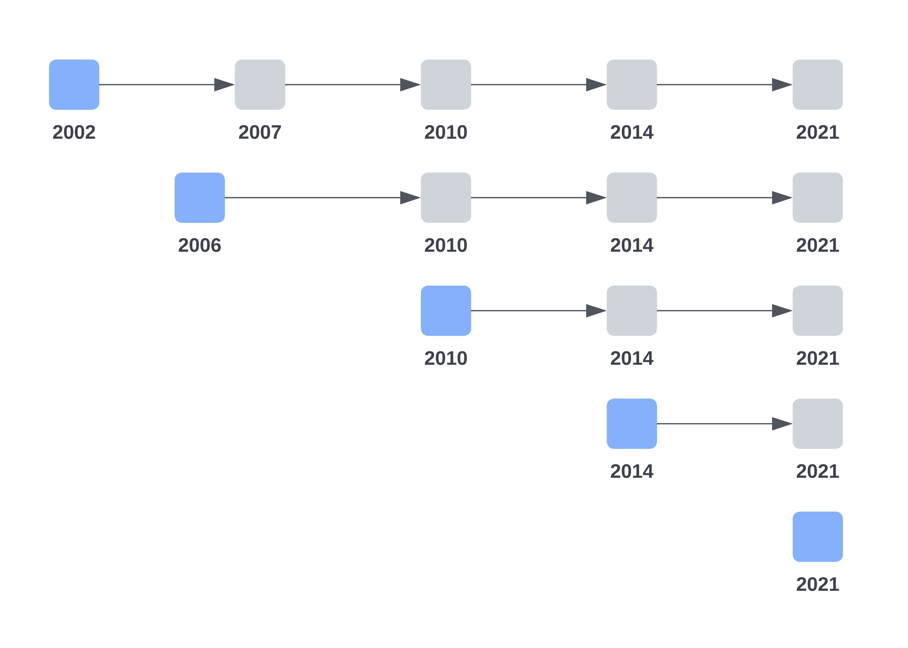

### This repository contains the R scripts for:

Willi Zhang, Per Tynelius, Maya B. Mathur, Matteo Quartagno, Gunnar Brandén, Fredrik Liljeros, Kyriaki Kosidou. **Temporal Trends in Sexual Identity and Sociodemographic Disparities in Stockholm, Sweden, 2010 to 2021.** 2025. _American Journal of Public Health. In Press._

The R scripts include:
* **SPHC-B-2010.Rmd:** analyses of sexual identity using SPHC-B 2010 dataset.
* **SPHC-B-2014.Rmd:** analyses of sexual identity using SPHC-B 2014 dataset.
* **SPHC-B-2021.Rmd:** analyses of sexual identity using SPHC-B 2021 dataset.
* **Summary_plots_cc.Rmd:** drawing summary plots from complete-case analyses.
* **Summary_plots_imp.Rmd:** drawing summary plots from multiple imputation analyses.

<small>_Notes:_ For simplicity, we use the term “SPHC-B + year” for the Stockholm Public Health Cohort (SPHC) baseline surveys, and “SPHC + year” for both baseline and follow-up surveys for a given cohort; for example, SPHC-B 2010 represents the baseline survey initiated in 2010, and SPHC 2010 denotes the cohort including SPHC-B 2010 and the follow-up surveys in 2014 and 2021. See Figure 1 below for an overview of SPHC surveys.<small>

 

<small>**Figure 1. Overview of the Baseline and Follow-Up Surveys in the Stockholm Public Health Cohort 2002–2021** <small>
<small>The baseline surveys are denoted by blue-colored boxes, each labeled with the respective calendar year. Participants from each baseline survey were followed prospectively through to 2021, which is indicated by grey-colored boxes alongside their corresponding years.<small>

 

**Data Availability** 
The datasets generated and/or analyzed during the current study are not publicly available due to privacy and ethical reasons, but can be accessed after approved ethics application to the Steering Committee of the [Stockholm Public Health Cohort](https://www.ces.regionstockholm.se/projekt-och-uppdrag/halsa-stockholm/SPHC-data/).

**Contact** 
For any queries related to this repository, please contact: [Willi Zhang](https://ki.se/en/people/willi-zhang), Email: willi.zhang@ki.se.

**License** 
This work is licensed under the [Creative Commons Attribution 4.0 International License](https://creativecommons.org/licenses/by/4.0/) (CC BY 4.0), which allows others to distribute, remix, adapt, and build upon the work, with appropriate credit to the original authors.
